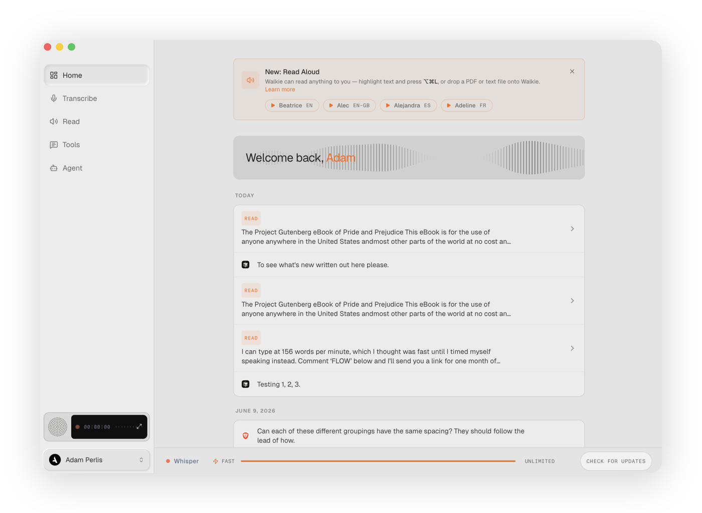
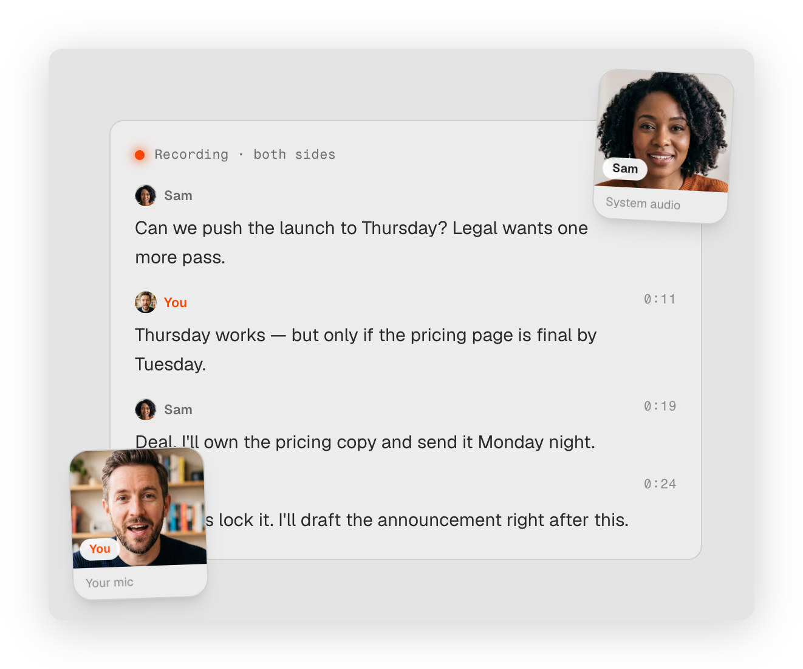

<p align="center">
  
</p>

<h1 align="center">Walkie for MCP</h1>

<p align="center">
  <b><a href="https://trywalkie.com">Walkie</a></b> turns speech into text and meetings into searchable notes — on your computer.<br/>
  This repository is Walkie's <b>Model Context Protocol (MCP) connector</b>, which lets Claude, Cursor, and any MCP client read your recorded meetings.
</p>

<p align="center">
  
</p>

## What Walkie does

Walkie is a speech-to-text app for **macOS, Windows, and Linux**:

- **Dictate anywhere.** Press a global hotkey and talk — Walkie transcribes, cleans up the text (punctuation, filler removal, your custom vocabulary), and types or pastes it into whatever app you're in.
- **Record & understand meetings.** Walkie records your calls and produces speaker-labeled transcripts, AI summaries, action items, and participant lists. It recognizes video calls (Meet, Zoom, Teams) and imports from Granola and Otter.
- **Local or cloud — your call.** Run transcription fully **on-device** for privacy, or in the cloud for maximum speed, and switch right from the home screen.
- **Read Aloud.** Have any text read back to you in a natural voice.
- **Yours to control.** Custom dictionary, snippets, per-app text styles, and keyboard shortcuts. In Local mode, nothing leaves your machine.

Dictation is free; meetings and this MCP connector are part of the Work plan.

<p align="center">
  
</p>

## What this connector adds

Once connected, your AI assistant can work with your meeting history:

- **search_meetings** — find meetings by keyword across titles, your notes, and transcripts.
- **get_meeting** — read one meeting's notes, action items, participants, and full transcript.
- **list_meetings** — browse every meeting as metadata (requires full archive access).

All three tools are **read-only** — the connector never changes your data.

## Install

### Claude Desktop (one click)
Download **[walkie.mcpb](./walkie.mcpb)** and open it in Claude Desktop (**Settings → Extensions → Install**). It launches Walkie's local server automatically and carries the Walkie icon.

### Any MCP client (command)
```
claude mcp add walkie -- /Applications/Walkie.app/Contents/MacOS/walkie --mcp-serve
```

### Remote (web/mobile clients)
Connect over OAuth 2.0 to `https://mcp.trywalkie.com/mcp`.

## Requirements

- The **Walkie desktop app** (macOS/Windows) — the local server reads Walkie's on-device meeting database.
- A **Walkie Work plan** or higher.

## Privacy

The connector runs on your computer and reads only your local Walkie data to answer your client's requests — it sends nothing anywhere itself. Full policy: <https://trywalkie.com/en/privacy>

## License

MIT — see [LICENSE](./LICENSE).
